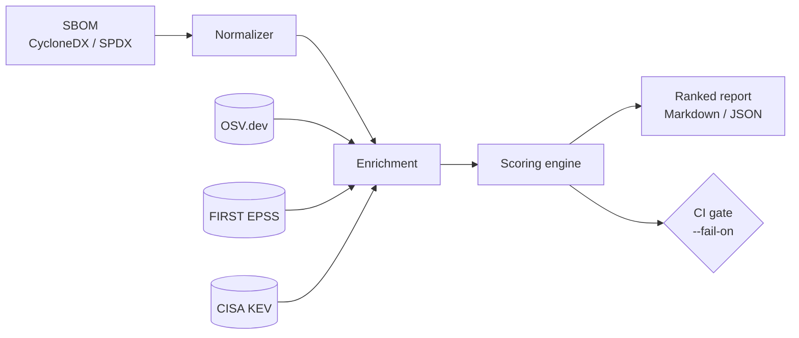

<h1 align="center">SBOM-Risk-Analyzer</h1>

<p align="center">
  <em>Exploitability-weighted vulnerability prioritization for software bills of materials.</em>
</p>

<p align="center">
  <a href="https://github.com/Azcerate/sbom-risk-analyzer/actions/workflows/ci.yml"></a>
  
  
  
</p>

---

## Abstract

Severity scores (CVSS) describe the *potential* impact of a vulnerability but say
nothing about whether it is being exploited. Programs that triage strictly by CVSS
therefore expend scarce remediation capacity on high-severity findings that are not
under attack while under-weighting lower-severity findings that are.
**SBOM-Risk-Analyzer** ingests a CycloneDX or SPDX software bill of materials, enriches
each component with vulnerability data (OSV), exploit-prediction probability (FIRST
EPSS), and confirmed in-the-wild exploitation (CISA KEV), and produces a transparent,
reproducible priority ranking that reflects how mature vulnerability-management
programs actually decide what to fix first.

## Table of Contents

- [Motivation](#motivation)
- [Scoring Model](#scoring-model)
- [Architecture](#architecture)
- [Installation](#installation)
- [Usage](#usage)
- [Data Sources](#data-sources)
- [Reproducibility and Offline Operation](#reproducibility-and-offline-operation)
- [Worked Example](#worked-example)
- [Limitations and Threats to Validity](#limitations-and-threats-to-validity)
- [References](#references)
- [Citation](#citation)
- [Author](#author)
- [License](#license)

## Motivation

The Log4Shell incident is the canonical illustration: a single component (CVSS 10.0)
that was also being mass-exploited demanded immediate action, while many other 10.0
findings in the same inventory did not. The signal that distinguished them was not
severity but **exploitation status**. This tool operationalizes that distinction by
treating known and predicted exploitation as first-class inputs to prioritization,
and by emitting an explainable score so that a reviewer can see *why* a finding ranks
where it does.

## Scoring Model

```
score = CVSS x (1 + 1.5 * KEV + 1.0 * EPSS)        # clamped to [0, 25]

tier  = Critical   if KEV (confirmed in-the-wild exploitation)
        High       if score >= 12
        Medium     if score >= 6
        Low        otherwise
```

The KEV term dominates because confirmed exploitation is the strongest available
evidence of real risk; EPSS (a 0–1 exploitation probability) is the next strongest.
The model is intentionally small and is documented in `sbomrisk/score.py` so that
teams can tune the weights to their own risk appetite and defend the result in audit.

## Architecture



## Installation

```bash
git clone https://github.com/Azcerate/sbom-risk-analyzer.git
cd sbom-risk-analyzer
pip install -e .          # Python standard library only — no runtime dependencies
```

## Usage

```bash
# Live enrichment (OSV + EPSS + CISA KEV)
sbomrisk examples/sbom.cyclonedx.json -o risk-report.md

# Deterministic / offline (CI, air-gapped) using a local fixture
sbomrisk examples/sbom.cyclonedx.json --offline examples/offline_fixture.json

# Fail a pipeline when any confirmed-exploited (KEV) finding is present
sbomrisk sbom.json --offline examples/offline_fixture.json --fail-on critical

# Machine-readable output
sbomrisk sbom.json --format json
```

## Data Sources

| Signal | Source | Role in score |
|--------|--------|---------------|
| Vulnerability identity & CVSS | [OSV.dev](https://osv.dev/) | Base impact |
| Exploit-prediction probability | [FIRST EPSS](https://www.first.org/epss/) | Likelihood weight |
| Confirmed in-the-wild exploitation | [CISA KEV](https://www.cisa.gov/kev) | Dominant priority term |

## Reproducibility and Offline Operation

All network access is isolated to the enrichment layer. Passing `--offline <fixture>`
substitutes a local JSON snapshot for live API calls, which makes runs fully
deterministic — a requirement for hermetic CI, regression testing of the scoring
model, and operation in air-gapped or regulated environments. The committed fixture
reproduces the worked example below without network access.

## Worked Example

| Priority | Component | CVE | CVSS | EPSS | KEV | Score |
|----------|-----------|-----|------|------|-----|-------|
| Critical | log4j-core@2.14.1 | CVE-2021-44228 | 10.0 | 0.97 | YES | 25.0 |
| High | requests@2.19.1 | CVE-2018-18074 | 9.8 | 0.32 | – | 12.94 |
| Medium | lodash@4.17.4 | CVE-2019-10744 | 9.1 | 0.10 | – | 10.01 |

Note that `requests` (CVSS 9.8) outranks `lodash` (CVSS 9.1) on EPSS alone, while
`log4j-core` is elevated to Critical by its KEV status despite a CVSS only marginally
higher than the others — the exact behavior a severity-only sort would miss.

## Limitations and Threats to Validity

- **Source coverage.** Findings are bounded by OSV advisory coverage for the component
  ecosystem; absence of a finding is not evidence of absence of vulnerability.
- **Score calibration.** The weights are defensible defaults, not empirically optimized
  constants; teams should calibrate against their own remediation outcomes.
- **Temporal drift.** EPSS and KEV are time-varying; a report is a point-in-time
  snapshot and should be regenerated on a cadence.
- **No reachability analysis.** The tool does not determine whether vulnerable code is
  actually invoked; it prioritizes presence-plus-exploitability, not reachability.

## References

1. FIRST. *Exploit Prediction Scoring System (EPSS).* https://www.first.org/epss/
2. CISA. *Known Exploited Vulnerabilities Catalog.* https://www.cisa.gov/kev
3. Open Source Vulnerabilities (OSV). https://osv.dev/
4. CISA / NTIA. *The Minimum Elements for a Software Bill of Materials (SBOM).* 2021.
5. OWASP. *CycloneDX Specification.* https://cyclonedx.org/

## Citation

See [`CITATION.cff`](CITATION.cff), or:

```bibtex
@software{saunders_sbom_risk_analyzer,
  author = {Saunders, Anthony N.},
  title  = {SBOM-Risk-Analyzer: Exploitability-Weighted Vulnerability Prioritization for SBOMs},
  year   = {2026},
  url    = {https://github.com/Azcerate/sbom-risk-analyzer}
}
```

## Author

**Anthony N. Saunders, MSCS, CISM, CISA** — Product Security & AI Security Engineer.
Research interests: software supply-chain security, vulnerability management, and
medical-device cybersecurity.

## License

Released under the [MIT License](LICENSE).
